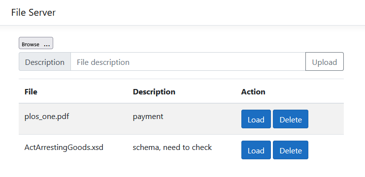

## File Server on ASP.NET
Sample ASP.NET Core MVC application for uploading files to the server.

Files and description are stored in the application folder.

Possible actions:
* Upload file to server with some description
* Show all files name and description
* Load file from server
* Delete file from server

One [view](Views/Home/Index.cshtml), one [controller](Controllers/HomeController.cs) with methods for each action. 
